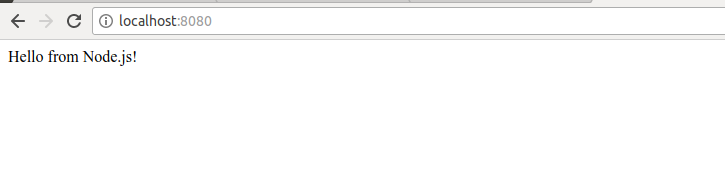

# Docker HelloNode App

A basic hello world node js application deployed on Docker

#### How to run the app?

Build the docker image
`docker build -t node-js-app .`

Verify if the node-js-app image is built
`docker images`

Build the container. Expose the port 80 and detach(-d) from the terminal once the container is created 
`docker run -p 8080:80 -d node-js-app`

Verify that the container is built
`docker ps`

Check the logs for the container
`docker logs <container id>`

Expected output
```
npm info it worked if it ends with ok
npm info using npm@4.2.0
npm info using node@v7.10.1
npm info lifecycle docker_web_app@1.0.0~prestart: docker_web_app@1.0.0
npm info lifecycle docker_web_app@1.0.0~start: docker_web_app@1.0.0

> docker_web_app@1.0.0 start /usr/src/app
> node server.js

Running on http://0.0.0.0:80
```

Expected Output



